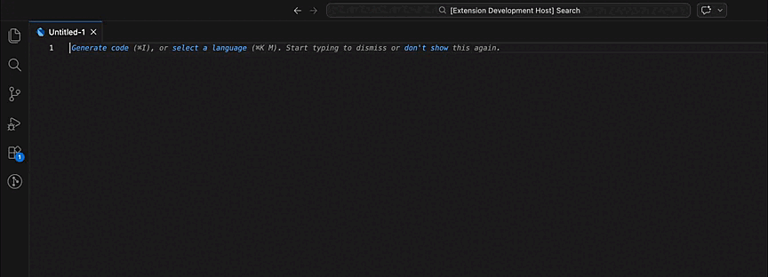
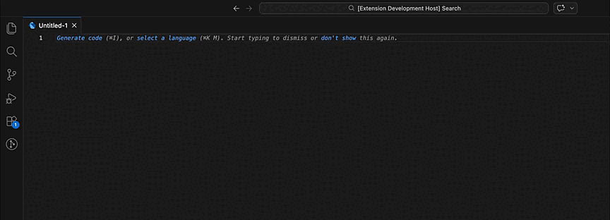
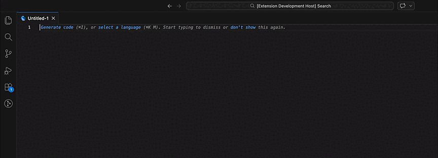
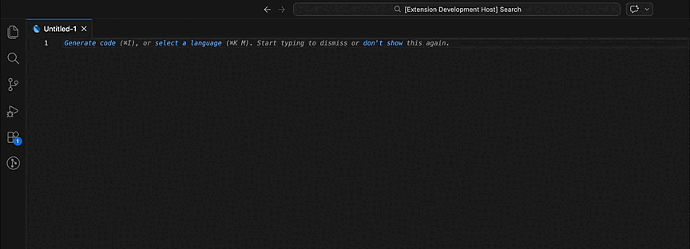

# Flutter Freezed Helpers VSCode Extension

Helps you write [Freezed](https://pub.dev/packages/freezed) annotated classes (compatible with **Freezed 2.x / Dart 3**) and run code generation directly from VS Code.

👉 [Flutter Freezed Model Helper on Visual Studio Marketplace](https://marketplace.visualstudio.com/items?itemName=GuilhermeLague.vscode-flutter-freezed-helper)

## Fork Notice

This extension is a fork of [mthuong/vscode-flutter-freezed-helper](https://github.com/mthuong/vscode-flutter-freezed-helper), created because the original repository has been inactive for 5 years.

## Setup

Add the following to your `pubspec.yaml`:

```yaml
dependencies:
  freezed_annotation: x.x.x
  json_annotation: x.x.x

dev_dependencies:
  build_runner: x.x.x
  freezed: x.x.x
  json_serializable: x.x.x

```

## Features

### `frf` — Setup a new file with a Freezed class

Expands to a complete file skeleton with imports, `part` directives and a model class compatible with Freezed 2.x / Dart 3:

```dart
import 'package:freezed_annotation/freezed_annotation.dart';

part 'my_model.freezed.dart';
part 'my_model.g.dart';

@freezed
abstract class MyModel with _$MyModel {

  const factory MyModel({
    required String id,
  }) = _MyModel;

  factory MyModel.fromJson(Map<String, dynamic> json) =>
      _$MyModelFromJson(json);
}
```



### `frc` — Add a Freezed class

Expands to a standalone Freezed class body, useful when the file is already set up:

```dart
@freezed
abstract class MyModel with _$MyModel {

  const factory MyModel({
    required String id,
  }) = _MyModel;

  factory MyModel.fromJson(Map<String, dynamic> json) =>
      _$MyModelFromJson(json);
}
```



### `frfp` — Setup a new file with a Freezed class with private constructor

Same as `frf` but includes `const ClassName._()`, which allows you to add custom methods and getters to the class — required by Freezed whenever you need methods (e.g. mapping a model to a domain entity):

```dart
import 'package:freezed_annotation/freezed_annotation.dart';

part 'my_model.freezed.dart';
part 'my_model.g.dart';

@freezed
abstract class UserModel with _$UserModel {
  const UserModel._(); // enables custom methods

  const factory UserModel({
    required String id,
  }) = _UserModel;

  factory UserModel.fromJson(Map<String, dynamic> json) =>
      _$UserModelFromJson(json);

  UserEntity toEntity() => UserEntity(id: id);
}
```



### `frcp` — Add a Freezed class with private constructor

Same as `frc` but includes `const ClassName._()`, which allows you to add custom methods and getters to the class — required by Freezed whenever you need methods (e.g. mapping a model to a domain entity):

```dart
@freezed
abstract class UserModel with _$UserModel {
  const UserModel._(); // enables custom methods

  const factory UserModel({
    required String id,
  }) = _UserModel;

  factory UserModel.fromJson(Map<String, dynamic> json) =>
      _$UserModelFromJson(json);

  UserEntity toEntity() => UserEntity(id: id);
}
```



Cursor (`$0`) is placed inside the class body, ready to write the first method.

---

### Run Code Gen

Runs `dart run build_runner build` in the workspace root.

### Toggle Watch Mode

Starts or stops `dart run build_runner watch` to continuously regenerate code on file changes.

## Credits

This extension is a fork of [mthuong/vscode-flutter-freezed-helper](https://github.com/mthuong/vscode-flutter-freezed-helper), created because the original repository has been inactive for 5 years.

